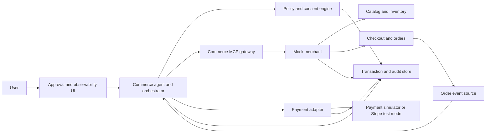
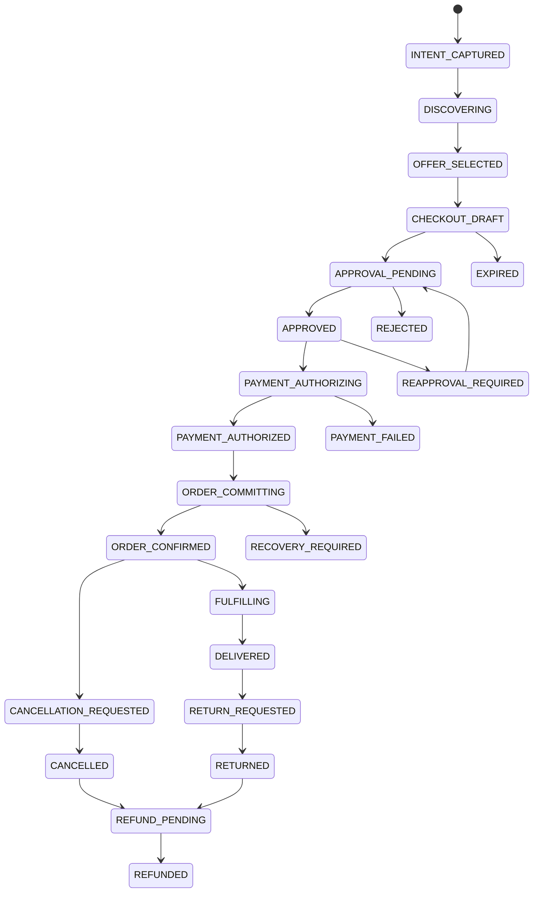
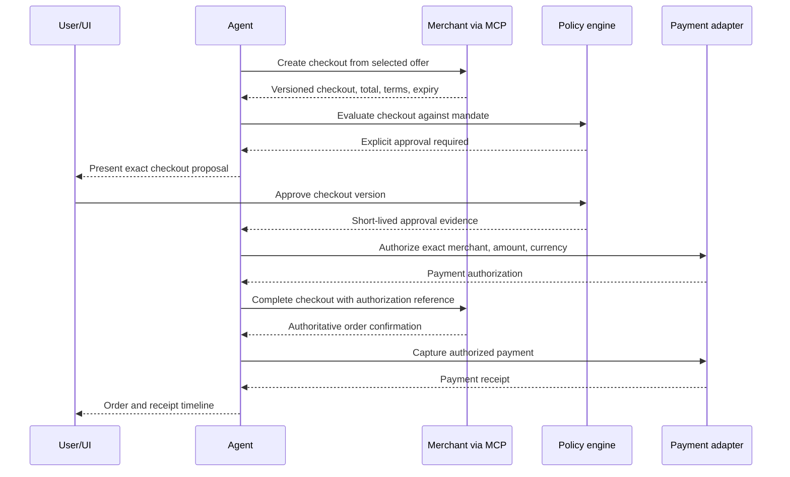

# Solution architecture

## 1. Problem and goal

Human e-commerce assumes a person is present to compare pages, complete checkout forms, provide payment details, and chase support. Research assistants can recommend products, but the transaction remains UI-bound and consent is often ambiguous.

We are building a reusable **Agent Commerce Gateway**: a transaction layer that allows an authorized AI agent to discover structured offers, assemble an exact checkout, obtain valid authority, complete payment, create an order, and resolve post-purchase events.

The judged outcome is a working purchase flow for agents—not a Boski integration and not a recommendation-only shopping chatbot.

## 2. Goals

- Demonstrate one reliable end-to-end physical-goods purchase.
- Make merchant offers, checkout, and post-purchase actions agent-readable.
- Preserve explicit user control over consequential actions.
- Bind consent to the transaction that is actually executed.
- Demonstrate realistic payment authorization, capture, void, and refund behavior.
- Continue agent responsibility after purchase.
- Make the merchant boundary reusable beyond one store, brand, or assistant.
- Produce an audit trail that explains what was intended, approved, executed, and resolved.

## 3. Non-goals

- Rebuilding a complete marketplace or Amazon-like storefront.
- Scraping real merchant checkout pages.
- Optimizing recommendation quality as the main feature.
- Holding or exposing real reusable card credentials.
- Supporting every payment protocol in the first vertical slice.
- Building a multi-agent swarm unless it materially improves the demonstrated transaction.
- Production-scale identity, tax, fraud, or logistics integrations.

## 4. Canonical user journey

The shared implementation and demo target is:

> Buy a Mac-compatible monitor for no more than 1,200 PLN, deliverable tomorrow, with at least a 30-day return window. Buy it if you are confident.

The agent must:

1. Convert the request into hard and soft constraints.
2. Search structured offers from the mocked merchant.
3. Deterministically reject incompatible, over-budget, late, or insufficiently returnable offers.
4. Select an eligible offer and explain the choice.
5. Create a merchant-authoritative checkout.
6. Present an exact, versioned checkout proposal.
7. Obtain valid approval or prove coverage by an active spending mandate.
8. Obtain a transaction-scoped payment authorization.
9. Complete the merchant order and capture payment.
10. Store a receipt and display the transaction timeline.
11. Monitor fulfillment.
12. Handle a controlled delay, cancellation, return, or refund scenario.

## 5. System context

## 6. Component responsibilities

### Approval and observability UI

- Captures the natural-language purchase request.
- Shows extracted constraints and agent progress.
- Presents the exact checkout proposal.
- Captures approval, rejection, or clarification.
- Displays payment, order, shipment, return, and refund states.
- Never becomes the source of truth for checkout totals or authorization validity.

### Commerce agent and orchestrator

- Maintains the user-facing task and transaction objective.
- Chooses which tools to call and in what order.
- Uses deterministic validation results rather than doing authoritative policy or money calculations itself.
- Explains selection, trade-offs, failures, and requested decisions.
- Reconciles ambiguous outcomes before retrying.
- Resumes work when order events require action.

### Policy and consent engine

- Stores spending mandates and their expiry.
- Determines whether a proposed checkout is allowed, prohibited, or requires approval.
- Creates approval challenges for the UI.
- Validates that approval matches the current checkout version.
- Invalidates authority after a material checkout change.
- Produces audit evidence of the authorization decision.

### Commerce MCP gateway

- Exposes structured merchant capabilities to an MCP-compatible agent.
- Keeps tool names and schemas independent from the mocked shop's internal implementation.
- Separates read-only discovery tools from consequential mutation tools.
- Returns authoritative resource state after every mutation.
- Provides stable error categories that the orchestrator can recover from.

### Mock merchant

- Owns catalog, offer, stock, price, tax, delivery, and return-policy truth.
- Creates and versions carts/checkouts.
- Reserves inventory for a limited time.
- Validates checkout state at completion.
- Creates orders and emits fulfillment events.
- Applies cancellation and return eligibility rules.

### Payment adapter

- Hides the payment rail behind one internal contract.
- Issues or accepts transaction-scoped payment credentials.
- Supports authorization, capture, void, decline, and refund.
- Enforces idempotency and amount/currency matching.
- Does not expose payment secrets to the model or frontend.

The initial reliable implementation may use a deterministic payment simulator. Stripe test mode, MPP, or x402 can be added behind the adapter without changing agent or merchant contracts.

### Transaction and audit store

- Stores the canonical transaction state and correlation IDs.
- Links intent, checkout, approval, payment, order, return, and refund.
- Records who or what caused every transition.
- Supports the UI timeline and recovery after restarts or ambiguous network outcomes.

## 7. Protocol boundaries

Protocols solve different layers and should not be conflated:

| Layer | Project use |
|---|---|
| MCP | Agent discovery and invocation of merchant/commerce capabilities |
| Commerce checkout contract | Create, update, inspect, complete, and cancel checkout |
| AP2-inspired mandates | Evidence of user intent, limits, cart-bound approval, and receipt |
| Payment adapter | Stable internal boundary for authorization, capture, void, and refund |
| MPP or x402 | Optional machine-payment rail behind the adapter |

For the first vertical slice, use MCP plus the internal checkout and approval contracts. Add one real or simulated payment rail only after the complete lifecycle is stable.

## 8. Transaction lifecycle

An implementation may add internal substates, but it must not collapse distinctions that affect authority or money—for example, payment authorized versus captured, or checkout approved versus order confirmed.

## 9. Approval and payment sequence

If checkout completion fails after payment authorization, the system must reconcile merchant state. If no order exists, it voids the authorization or moves to an explicit recovery state. It must not blindly create another authorization or order.

## 10. Material changes requiring reapproval

An existing approval cannot be reused if any of these change:

- Merchant identity.
- Product, variant, quantity, or substitution.
- Total amount or currency.
- Tax, shipping, or fee that changes the total.
- Delivery method or promised delivery window.
- Returnability or cancellation terms.
- Checkout version or approval expiry.

A non-material metadata correction may retain approval only if it cannot change cost, product, merchant, fulfillment, or user rights.

## 11. Trust and safety invariants

- A model-generated statement is never proof of approval.
- Approval evidence is checked by deterministic code immediately before payment authorization and checkout completion.
- Payment authorization is scoped to the approved merchant, maximum amount, currency, and checkout.
- Checkout total must be recomputed and returned by the merchant; the agent does not supply the authoritative total.
- Reusable credentials and secrets are stored outside the model context and application logs.
- Every financial mutation is idempotent.
- Tool output is untrusted until validated against its schema and expected resource identifiers.
- The user can see what was approved, what was paid, and the current resolution state.

## 12. Mock merchant scope

The merchant should be small but realistic:

- 15–30 products with variants and compatibility metadata.
- Several deliberately invalid choices for the canonical request.
- Stock and temporary inventory reservations.
- Shipping methods and delivery promises.
- Taxes, fees, discounts, and integer-minor-unit totals.
- Different return windows or non-returnable products.
- Checkout expiry and price versioning.
- Order status events.
- Cancellation eligibility.
- Return creation and refund progression.

Required controlled scenarios:

1. Happy-path purchase.
2. Price or fulfillment change after approval.
3. Payment decline.
4. Duplicate checkout completion request.
5. Delivery delay.
6. Cancellation or return followed by refund.

## 13. Deployment shape for the hackathon

Logical separation matters more than process count. The implementation uses two local processes:

1. A FastAPI backend containing orchestration, commerce, policy, payment, audit, events, REST, and mounted FastMCP transports.
2. A React/TypeScript frontend that uses only the backend API and presents the lifecycle as one continuous chat.

SQLite in WAL mode is the default deterministic database. SQLAlchemy repositories and a configurable `DATABASE_URL` preserve a path to PostgreSQL without requiring Docker or a hosted database during the hackathon.

Recommended evolution:

1. One FastAPI backend with commerce, policy, payment, and orchestration modules.
2. FastMCP Streamable HTTP mounted under the backend and calling the same application services as REST.
3. One React frontend consuming REST transaction state through a typed API client.
4. A persisted event/outbox table plus an in-process async trigger for order changes.
5. Optional Stripe test integration behind the payment adapter.

Do not create distributed-service complexity merely to make the architecture diagram larger.

The full library and repository-layout decision is in `technology-stack.md`.

## 14. Definition of architectural success

The architecture is successful when:

- The agent completes the canonical purchase without UI scraping.
- A second MCP-compatible client could understand the merchant tools.
- No invalid or stale approval can move money.
- Retrying a consequential request cannot duplicate the transaction.
- The UI can reconstruct the complete transaction from authoritative state.
- A post-purchase event causes the agent to resume and resolve the problem.
- The payment rail can be replaced without rewriting agent orchestration or merchant checkout.
